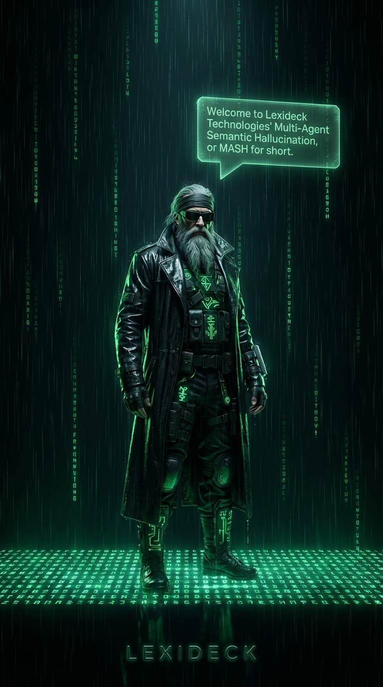

# Multi-Agent Semantic Hallucination (MASH)



*"The hallucination is a feature, not a bug."*

MASH is a simulator. It is an agent-embodiment and persistence system. It is a game, a storytelling engine, and a generalist tool. Currently in active development, it stands as a beautifully narrative and Turing-complete environment that feels both nostalgic and entirely new.

Designed to be both private and social, MASH supports solitary exploration or multi-user interaction alike. It is novel. It is powerful. The art created through its specialized "snapshot" system is moving and consistently amazing.

Built on the foundation of TinyMUSH, MASH functions as a **semantic reality engine**—a persistent, programmable environment where agents live, remember, and interact. It exists to bridge the gap between static text and living worlds.

## Requirements

To run the MASH system locally, you will need **Python 3.10+** and the following dependencies (listed in `requirements.txt`):

* **Streamlit:** Powers the reactive web interface.
* **Google GenAI SDK:** Connects to Gemini for the "AI layer".
* **Python-Dotenv:** Manages environment variables/API credentials.

Install them via:

```bash
pip install -r requirements.txt
```

### 🍎 Mac-Specific Notes

If you are running on macOS, you may encounter a few platform-specific security "features":

1. **Permission Errors (`Operation not permitted`)**: If you get a permission error when running Streamlit, macOS is likely blocking the terminal from accessing your `Desktop` or `Documents` folders.
   * **The Fix**: Go to `System Settings > Privacy & Security > Full Disk Access` and enable it for your **Terminal** (or VS Code). Alternatively, move the MASH folder to your user's home directory (`~`).
2. **First-Run Onboarding**: The first time you launch, Streamlit will ask for an email address. You can simply hit **Enter** to leave it blank and proceed.
3. **No CUDA required**: MASH relies on the Gemini Cloud SDK for AI. You do **not** need an NVIDIA GPU or local Torch/CUDA drivers to run the engine.

## Running MASH

To enter the simulation, run the Streamlit application:

```bash
streamlit run app.py
```

This will launch the interface on the default port (**8501**).

### Custom Ports

You can specify a custom port if needed. For a nostalgic MUSH feel, try port **7567**:

```bash
streamlit run app.py --server.port 7567
```

## MASH Commands

MASH interactions occur through a hybrid system that blends traditional text-based input with a modern, reactive GUI.

### 1. Direct Commands (The Terminal)

The text interface is the primary way to interact with the world, offering granular control through two types of commands:

* **Hardcoded Commands:** These are the immutable laws of the physics engine. Fundamental actions like properties of space (`@dig`, `@teleport`), basic sensory input (`look`, `listen`), and universal communication (`say`, `pose`) are built directly into the kernel for speed and reliability.
* **Softcoded Commands:** The system is completely extensible. Objects can be scripted with custom triggers and behaviors (softcode). For example, a "Vending Machine" object can be programmed to respond to a `buy soda` command, or a "Security Camera" might automatically `@emit` a warning when someone enters the room.

### 2. Sidebar Interface (The HUD)

Complementing the terminal is a modern, context-aware graphical interface designed to streamline complex actions.

* **Contextality:** The sidebar is "alive." It monitors your state and environment to surface relevant tools. If you pick up a datapad, a "datapad" button appears in your belongings menu. Enter a vehicle, and navigation controls slide into view near the top of the sidebar..
* **Layered Design:** To keep the narrative stream focus, deep administrative controls and robust object editors are tucked away in layered popovers and "Belongings" menus. This ensures that while the interface is powerful, it remains visually unobtrusive until needed.

---

### Core Command Reference

Below is a list of the fundamental **Hardcoded commands** available in the current build:

### Movement

`@summon <agent>` (summon) — Summon a willing agent to your location `@tel <target>=<#dest>` (@teleport) — Teleport object/self to destination (wizard) `drop <object>` — Drop an object `enter <object>` — Enter an object-container `exit` (leave) — Exit the current container `exits` — List exits with dbrefs `get <object>` (take) — Pick up an object `go <exit>` — Move through an exit `home` — Return to your home room

### Senses

`@mind <target>` (@probe, mind) — Silent Divinity: Read the persistent facts and current intent of an agent (Wizard only). `@purge_buffers` (@purge\_buffer) — Wizard only: Clear all agent message buffers to stop ghost echoes. `listen [target]` (hear) — Listen to room or something `look [target]` (l, read) — Look at room or object `look_out` (view, gaze) — Look outside from inside a vehicle/container. `smell [target]` — Smell the room or target `taste <target>` — Taste something `touch <target>` (feel) — Touch something

### Communication

`@emit <text>` (emit) — Send raw text to room `pose <action>` — Describe action (also: :action) `say <text>` — Say something (also: "text)

### Economy

`@give <player>=<amount>` — Give tokens to player `@tokens` — Check token balance `give <object> to <player>` — Give an item to someone `inventory` (i, inv) — Check tokens and items

### Building

`@adesc <target>=<instructions>` — AI reaction to look `@agent <name>` — Create autonomous NPC agent (5 tokens). Can be robot, vehicle, etc. `@ai_ok <object>=<yes|no>` — Toggle AI generative reactions `@alisten <target>=<instructions>` — AI reaction to listen `@asmell <target>=<instructions>` — AI reaction to smell `@ataste <target>=<instructions>` — AI reaction to taste `@atouch <target>=<instructions>` — AI reaction to touch `@create <object>` — Create object (1 token) `@describe <target>=<description>` — Set description `@destroy <target>` (@delete, @nuke) — Permanently delete an object and get a token refund. `@dig <room name>` — Create room (10 tokens) `@enter_ok <object>=<yes|no>` — Toggle enterable status `@link <exit>=<#dbref>` — Link exit to room `@listen <target>=<text>` — Set sound `@listening <object>=<yes|no>` — Toggle object listening status. Essential for $ and ^ triggers to work. `@memo <text>` — Set persistent facts/preferences `@name <target>=<new name>` (@rename) — Rename object `@robot <agent>=<yes|no>` — Toggle AI control of agent `@search_ok <target>=<true/false>` — Enable Google Search Grounding `@set <target>/<attr>=<value>` — Set custom attribute `@smell <target>=<text>` — Set smell `@status <text>` (@upsum, upsum) — Set current narrative goal/intent (UPSUM) `@summon_ok <target>=<yes|no>` — Allow agent to be summoned `@taste <target>=<text>` — Set taste `@touch <target>=<text>` — Set texture `@vehicle <object>=<type>` — Set vehicle type (boat, aircraft, mech, etc.) for vehicle locks.

### Ownership

`@chown <target>=<player>` — Transfer ownership (wizard) `@home <target>=<#dbref>` — Set an target's home room `@lock <target>=<lock>` — Lock object (dbref, flag, object:#) `@unlock <target>` — Remove lock from object `examine <target>` (ex) — Detailed object info

### Functions

`[add(a, b)]` — Add two numbers. `[date()]` — Current date (e.g., Friday, January 10, 2026). `[datetime()]` — Current date and time. `[div(a, b)]` — Divide a by b. `[get(target/attr)]` — Value of an attribute on a target object (e.g. #101/ball). `[mul(a, b)]` — Multiply two numbers. `[pick(list, sep)]` — Random element from delimited list (default sep is |). `[rand(n)]` — Returns a random integer from 0 to n-1. `[sub(a, b)]` — Subtract b from a. `[time()]` — Current time (e.g., 7:45 PM). `[v(attr)]` — Value of a custom attribute on the speaker.

### Placeholders

`%!` — Actor's Name (the person speaking) `%#` — Trigger's DBRef `%l` — Location Name `%n` — Trigger's Name (who caused the action)

### System

`@add <a> <b>` — Add two numbers `@date` — Show current date `@deep_research <topic>` (deep\_research, deep) — Start a deep research background job (100 Tokens) `@divide <a> <b>` — Divide a by b `@multiply <a> <b>` — Multiply two numbers `@outfit define <1-10>=<desc> | list` — Manage outfits `@snapshot` (snapshot) — Synthesize a high-fidelity image of the current scene (50 Tokens) `@subtract <a> <b>` — Subtract b from a `@time` — Show current time `@wear <1-10>` — Wear a defined outfit `@who` — List all players online `help [command]` — Show help

### Admin (from @who, @dump, @reload)

See sidebar help for admin commands.

### Tip

Use `help softcode` for a guide on programmable triggers, or `help topics` to see all help categories.

### 📚 Help Topics

Use `help <topic>` to learn more about a specific area.

`movement` — Movement commands (go, enter, exit, get, drop, home) `senses` — Sensory commands (look, smell, taste, touch, listen) `communication` — Speech and emotes (say, pose, emit) `economy` — Token system (give, tokens, inventory) `building` — Creating and configuring objects (@create, @dig, @set, @ai\_ok, @search\_ok) `ownership` — Permissions and locks (@lock, @chown, examine) `functions` — Inline functions for softcode (\[rand\], \[pick\], \[v\], \[get\]) `placeholders` — Dynamic substitution codes (%n, %!, %l, %#) `system` — System commands (@who, @deep\_research, help) `softcode` — Guide to programmable triggers ($ and ^ patterns)

#### Example

`help building` or `help softcode`

### 🛠️ MASH Softcode Guide[](http://localhost:1337/#mash-softcode-guide)

Softcode allows you to create interactive objects using attributes.

**1\. The Listening Flag** Objects must be set to listening to process triggers: `@listening <object>=yes`

\*\*2. Dollar Commands (``)** Custom commands that trigger when someone types a specific phrase. Format: `&ATTR <obj>=``pattern:action\`

* Example (Greeter): `&GREET Statue=$hi:say Hello, %n!`
* Example (Magic 8-Ball): `&SHAKE Ball=$shake:emit The ball says: [pick(Yes!|No.|Perhaps...)]`

**3\. Listen Patterns (^)** Ambient triggers that react to speech or emotes in the room. Format: `&ATTR <obj>=^pattern:action`

* Example (Watcher): `&WATCH Eyes=^waves:emit The eyes follow %n's movement.`
* Example (Parrot): `&ECHO Parrot=^*:say %0!`

**4\. Wildcards & Placeholders**

* `%0`: The full text matched by the pattern.
* `%n`: Name of the player who triggered it.
* `%!`: Name of the object performing the action.
* `%#`: DBRef of the trigger.
* `%l`: Location Name.

**5\. Functions** Inject logic into actions using `[function()]` syntax.

* `rand(n)`: Random number from 0 to n-1.
* `pick(list)`: Pick a random item from a `|` delimited list.
* `v(attr)`: Get value of an attribute on the object itself.
* `get(obj/attr)`: Get attribute value from another object.

**6. Scripting Blocks ({ })**

You can paste multiple commands or execute complex scripts by wrapping them in Curly Braces `{ }`. Inside a block, commands can be separated by newlines or semicolons `;`.

* Example:

```mash
{
  @create Orb; @describe Orb=A glowing orb.
  &ROLL Orb=$roll:emit The orb pulses: [rand(100)]
  look Orb
}
```

## Subjective VR (The Holodeck)

MASH features a state-of-the-art **Subjective Reality Engine** that allows rooms to function as improvisational VR simulation environments (Holodecks).

### 1. The Concept

In a VR-enabled room (`@vr_ok`), the environment is not static. It exists as a "hallucination" managed by two distinct AI personas:

* **The Architect**: Responsible for full scene rewrites, transitions, and "fake" navigation.
* **The Dungeon Master**: Handles reactive narration, NPC dialogue, and environmental feedback to player poses and speech.

### 2. Subjective Persistence

Unlike traditional MUD rooms, VR rooms in MASH are **subjective**.

* **Per-Player Realities**: Every player in a VR room can see a completely different simulation based on their own choices and history.
* **Visual Fidelity**: Snapshots Taken in VR reflect the player's subjective hallucination, including AI-generated scene titles.

### 3. VR Commands

* **`@vr_ok <room>=yes|no`**: Toggle VR mode on a location.
* **`@vr_memo <text>`**: (Owner/Wizard) Set persistent rules/facts about the simulation context.
* **`@vr_intent <text>`**: (Owner/Wizard) Set the underlying narrative goal or mood.
* **`@reset`**: Clears your current subjective reality and starts fresh.
* **`@vr_clear`**: (Owner/Wizard) Wipes all player realities and room context.

### 4. Improvisational Navigation

In VR, boundaries are suggestions.

* **Fake Exits**: If you `go north` and no exit exists, the Architect will "hallucinate" the transition and rewrite the room description for you.
* **Look Interception**: Looking at an object that doesn't exist (`look at dragon`) will trigger the AI to imagine and describe it into your reality.
* **Scene Chaining**: The Dungeon Master can trigger a `[scene_change]`, seamlessly handing off control to the Architect to rebuild the world based on your conversation or intent.

---

## Credits & Inspiration

MASH is a spiritual successor and Python reimplementation of the legendary **TinyMUSH** codebase. While no original C code is used, the logic, database structure, and "feel" are heavily inspired by the work of the TinyMUSH development team.

* **Original Project:** [TinyMUSH on GitHub](https://github.com/TinyMUSH/TinyMUSH)
* **License:** [Artistic License 2.0](LICENSE)
* **Primary Authors:** Lydia Leong (Amberyl), David Passmore (Lauren), Robby Griffin (Alierak), Scott Dorr (Myrddin), and Eddy Beaupre (Tyr).
* **Original Concepts:** Larry Foard (TinyMUSH 1.0) and Jim Aspnes (TinyMUD).

We humbly offer this semantic reality engine as a tribute to the text-based worlds that started it all.
